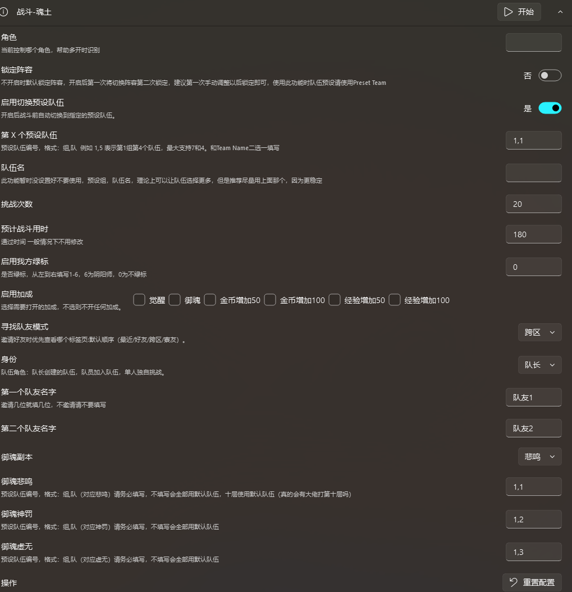

<h1 align="center">ok-Onmyoji</h1>

## ⚠️ 免责声明

本软件为外部辅助工具，旨在自动化《阴阳师》的部分游戏流程。它完全通过模拟常规用户界面与游戏交互，遵循相关法律法规。本项目旨在简化用户的重复性操作，不会破坏游戏平衡或提供不公平优势，也绝不会修改任何游戏文件或数据。

本软件开源、免费，仅供个人学习与交流使用，请勿用于任何商业或营利性目的。开发者团队拥有本项目的最终解释权。因使用本软件而产生的任何问题，均与本项目及开发者无关。

本项目使用了随机点击和模拟人为的休息模式，但依旧无法保证百分百安全，用别怕，怕别用

**使用本软件即表示您已阅读、理解并同意以上声明，并自愿承担一切潜在风险。**

## 功能介绍

一. **在阅读本文档之前，请先阅读readme文档保证已经成功运行该项目。**

二. 任务的使用
1. 当点击进入任务页面会看到各个能使用的任务
2. 每个任务都有相应的参数，在启动各个任务前，应先对各个参数进行设置
3. 以魂土任务为例，各个参数如下：
 
4. 魂土参数有详细的介绍也容易理解，其他所有任务大同小异

三. 实时触发-后台调度的使用
1. 本任务旨在定时执行用户指定的某任务
2. 使用前在调度面板处，先勾选想要运行的任务，并设置上一次运行时间，运行间隔等参数，下次运行时间会自动计算
3. 示例：勾选魂土任务 设置好参数后会自动计算满足下次运行的时间，如下图所示上次运行时间为2026.8.16，间隔时间为十分钟，系统自动计算满足体条件的下次运行时间
   
4. 在实时触发-后台调度中设置好检查间隔，此参数的目的是时隔多久检测时间是否满足，当时间满足时即可自动启动任务
5. 在使用前应该先设置好各个任务的参数
6. 请给每个任务充分的运行时间，比如刷100次魂土，大概需要一个小时，但设置时请设置一个半小时甚至更多，保证任务顺利完成

## 建议的使用方式
1. **对于大量的重复任务超过（三十次），比如活动爬塔，挖土等等，作者的建议是，请务必使用随机休息功能，甚至搭配后台调度功能一起使用**
2. **使用示例，比如想一次刷1000次活动爬塔，一口气刷完显然是不太合适的，首先设置战斗次数100次，启用随机休息功能输入参数，1,20,60,30,120，随机打20至60次后随机休息30到120秒，然后在后台调度中设置每隔一小时打启动一次活动爬塔任务**
3. **按上述的参数设置后，每隔一小时打100次，低频率的消耗自己的资源，而不是一口气清空，这样或许能更加安全。当然作者没有数据，只是建议**
4. 对于普通的日常任务，比如个人结界突破，地域鬼王等，正常使用即可，上述只针对那些需要大量时间挂机的任务。
